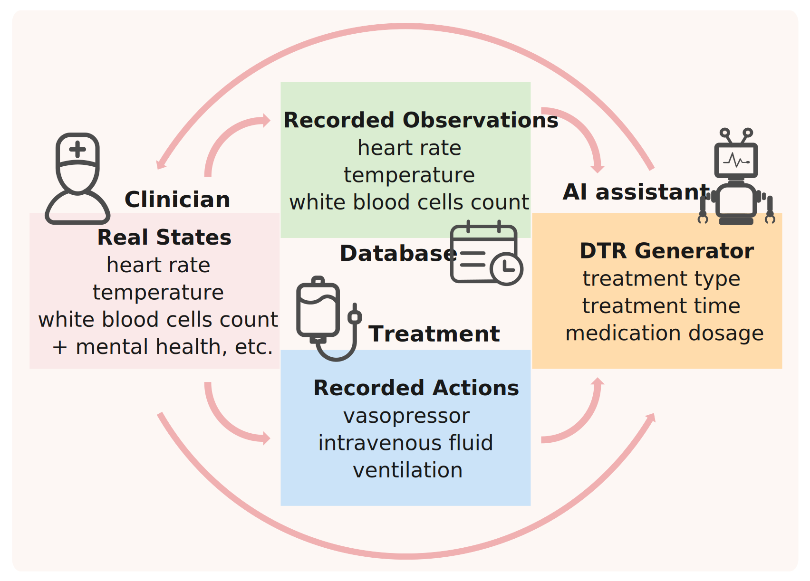
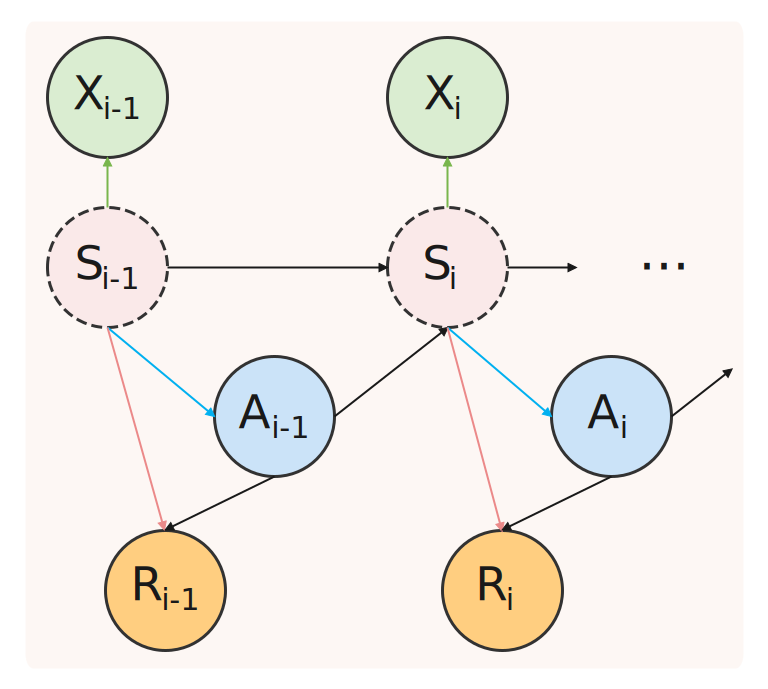
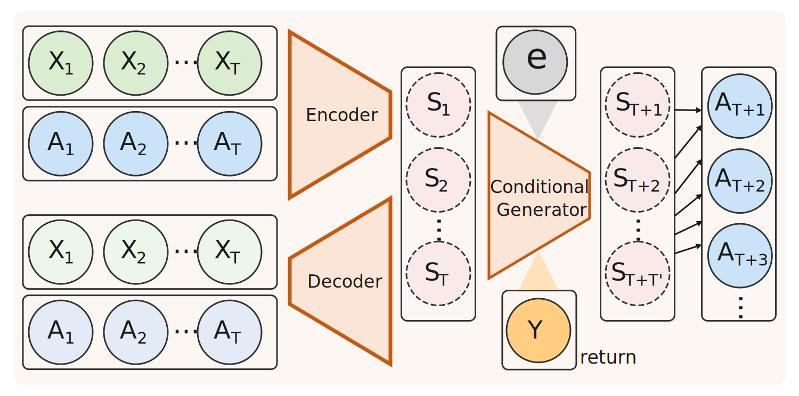
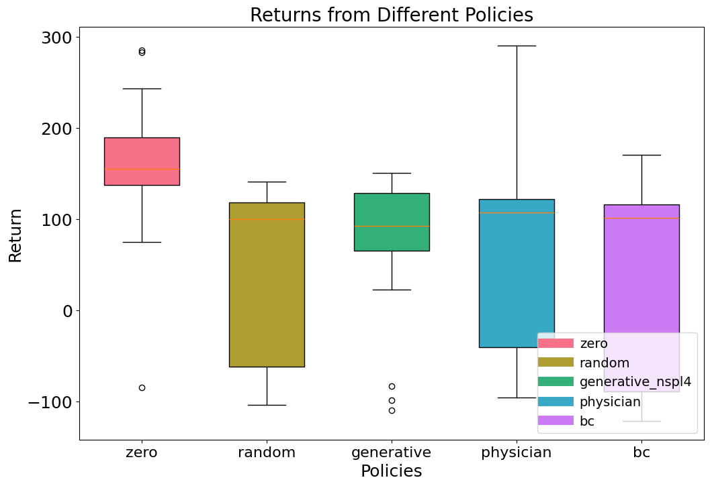
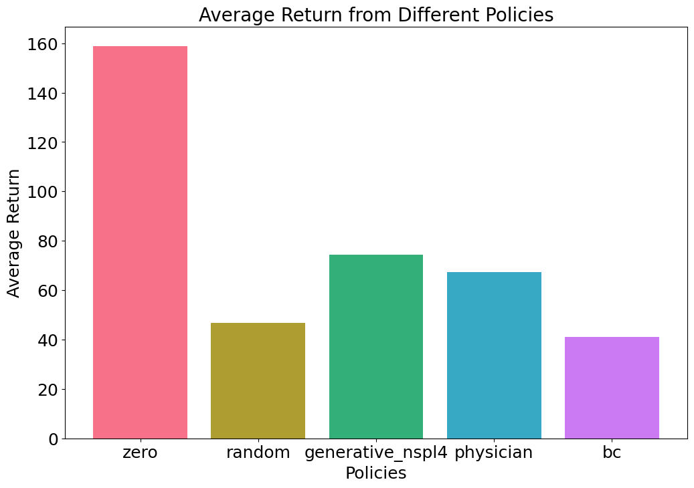

# BACKGROUND

- **Dynamic Treatment Regimes (DTRs)** aim to prescribe treatment plans at various stages based on an individual's time-varying characteristics.
- Learning DTRs through direct interaction with clinical environments is often impractical due to ethical constraints, necessitating the use of offline data from pre-collected electronic health records.
- The presence of unobserved confounders arising from incomplete patient records could result in biased treatment policies.

# OBJECTIVES

- Develop an offline DTR learning algorithm that mitigates the impact of hidden confounders by introducing deconfounding methods.
- Derive the distribution of feasible treatments at each stage using the generative DTR modeling to provide a series of timely personalized treatment recommendations for clinicians.
- Incorporate feedback from human clinicians to the DTR generator and examine the trade-off between the number of generated samples and the accuracy of clinician decisions.

# RESULTS

![Change the number of generated states]](average_return_plot.svg)
